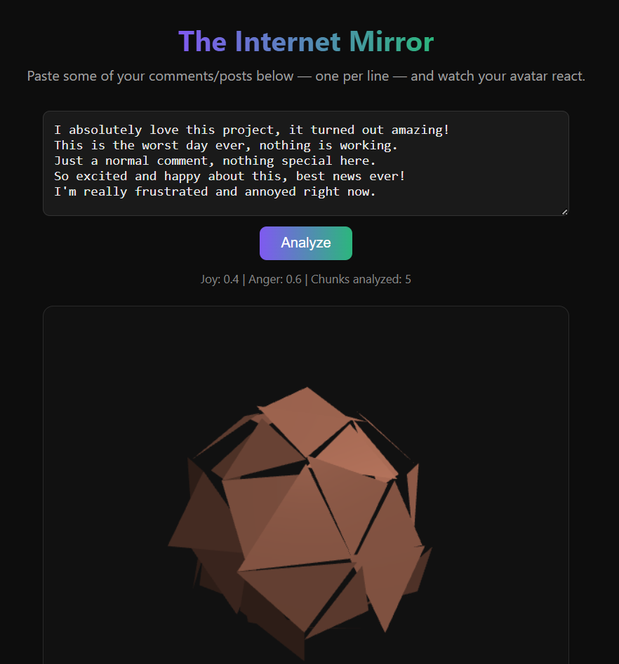

# 🎯 ReviewPulse

**🔗 Live demo:** https://sinchana1234-dev.github.io/internet-mirror/  
**⚙️ Backend API:** https://internet-mirror.vercel.app

I help brands turn 1-star reviews into 5-star customer experiences automatically.

A tool for e-commerce sellers (Amazon, Shopify, D2C brands) that analyzes customer review sentiment in real time and generates ready-to-send responses — so no review sits unanswered.

## What it does

Paste in a batch of customer reviews (one per line), and the app:
1. Runs each review through sentiment analysis
2. Classifies it positive/negative with a confidence score
3. Generates a suggested reply for each review, tailored to its sentiment
4. Visualizes the overall sentiment mix via a reactive 3D avatar

## Demo



## Tech Stack

- **Frontend:** HTML/CSS/JavaScript + Three.js (WebGL 3D rendering)
- **Backend:** Flask (Python) on Vercel
- **Sentiment engine:** VADER (rule-based sentiment analysis)

## Business Model

| | |
|---|---|
| Target Client | Amazon sellers, Shopify store owners, D2C brands |
| Pricing | $29/month subscription OR $199 one-time setup |
| Value | Automates review response, protects brand reputation, saves time |

## Running locally

### Backend
```bash
cd backend
python -m venv venv
venv\Scripts\Activate.ps1      # Windows PowerShell
pip install -r requirements.txt
python app.py
```
Server runs at `http://127.0.0.1:5000`

### Frontend
Open `frontend/index.html` with VS Code's Live Server extension (or any static file server).

## Why I built this

To show how sentiment analysis can be packaged into a real, sellable tool — not just a numbers table, but something that directly saves a business time and protects their reputation.

## Roadmap

- [ ] Deploy live demo with new branding
- [ ] Editable auto-responses before sending
- [ ] Direct integration with Amazon/Shopify review APIs
- [ ] "Toxicity Cleaner" — AI-rewritten polite version of negative text